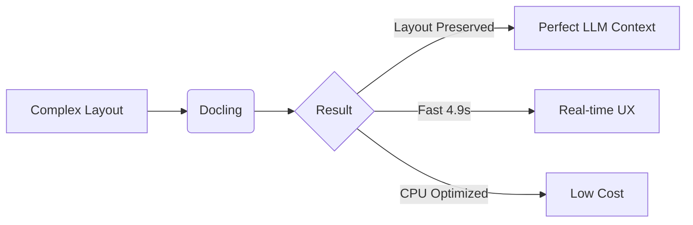

<div align="center">
  <picture>
    <source media="(prefers-color-scheme: dark)" srcset="docs/ConvexHire.png" />
    <source media="(prefers-color-scheme: light)" srcset="docs/ConvexHire_transparent.png" />
    
  </picture>
  
  # ConvexHire
  
  <h3>Multi-Agent Recruitment Automation & Job Marketplace</h3>
  
  <p>
    <i>An intelligent, bias-aware recruitment platform leveraging Multi-Agent Systems (MAS) <br/> and Retrieval-Augmented Generation (RAG).</i>
  </p>

  <!-- Tech Stack Badges -->
  <p>
    <a href="https://www.python.org/">
      
    </a>
    <a href="https://nextjs.org/">
      
    </a>
    <a href="https://fastapi.tiangolo.com/">
      
    </a>
  </p>
  
  <!-- DevOps Badges -->
  <p>
    <a href="https://www.docker.com/">
      
    </a>
    <a href="https://github.com/astral-sh/uv">
      
    </a>
  </p>
  
  <!-- Repo Status -->
  <p>
    
    
    <br/>
    
    
    
  </p>
  
  <br/>

  [🚀 Quick Start](#-quick-start) • [📖 Documentation](#introduction) • [🏗️ Architecture](#-system-architecture) • [🔬 Benchmarks](#-technical-deep-dive-ocr-benchmark)
  
</div>

---

## 🛠️ Technologies & Stack

<div align="center">

| Technology | Icon | Description |
| :--- | :---: | :--- |
| **LangChain** |  | LLM application framework with chaining capabilities |
| **LangGraph** |  | Orchestration layer for cyclic multi-agent workflows |
| **LangSmith** |  | Observability, testing, and debugging platform |
| **Groq** |  | Ultra-low latency LLM inference engine |
| **Google Gemini** |  | Multimodal AI model for complex reasoning |
| **Qdrant** |  | Vector Search Engine for semantic matching |
| **Hugging Face** |  | SOTA Embedding models and Transformers |

</div>

---

## 💡 Why ConvexHire?

<table>
<tr>
<td width="33%" align="center">
  <h3>🤖 AI-Powered</h3>
  <p>Multi-agent system with specialized AI workers for screening, ranking, and scheduling.</p>
</td>
<td width="33%" align="center">
  <h3>🔍 Transparent</h3>
  <p>Explainable AI (XAI) provides clear reasoning for every candidate match score.</p>
</td>
<td width="33%" align="center">
  <h3>👥 Human-in-Loop</h3>
  <p>Critical hiring decisions always require human approval and oversight.</p>
</td>
</tr>
</table>

### The Problem We Solve
Traditional ATS platforms rely on opaque keyword matching, often disqualifying qualified candidates without explanation. **ConvexHire** bridges the "Candidate Experience Gap" through semantic understanding, deep document analysis, and transparent scoring.

---

## 🔄 System Workflow

> [!NOTE]
> Click on the diagram below to view it in full resolution.

<div align="center">
  <a href="docs/System flow diagram.png" target="_blank">
    
  </a>
  <br/>
  <em>Complete end-to-end recruitment workflow with AI agent orchestration.</em>
</div>

<br/>

**Human-in-the-Loop Checkpoints:**
1. `JD Approval` → Recruiter validates the AI-generated Job Description.
2. `Candidate Review` → Recruiter reviews shortlisted candidates.
3. `Final Decision` → Human confirmation before sending offers.

---

## 🏗️ System Architecture

> [!TIP]
> The system utilizes a microservices approach orchestrated by LangGraph.

<div align="center">
  <a href="docs/Architecture Diagram.png" target="_blank">
    
  </a>
  <br/>
  <em>Scalable architecture featuring PostgreSQL, Qdrant, and External APIs.</em>
</div>

<br/>

| Layer | Technology | Function |
| :--- | :--- | :--- |
| **Orchestration** | LangGraph | Manages agent state, memory, and cyclic flows |
| **Persistence** | Supabase (PostgreSQL) | Relational data for users, jobs, and applications |
| **Vector Store** | Qdrant | Stores embeddings for semantic search |
| **Integrations** | Gmail / Google Calendar | Communication and interview scheduling |

---

## 🔬 Technical Deep Dive: OCR Benchmark

> [!IMPORTANT]
> **Challenge:** Accurately extracting text from scanned, multi-column CVs while preserving reading order.
> We evaluated 4 leading engines on complex, double-column resumes.

### 🏆 Performance Comparison

<div align="center">

| 🏅 Rank | OCR Engine | Avg. WER | Speed | Layout Quality | Verdict |
|:---:|:-----------|:--------:|:-----:|:--------------:|:----------------:|
| 🥇 | [**Docling (IBM)**](https://www.docling.ai/) | **3.1%** | **4.9s** | ⭐⭐⭐⭐⭐ | ✅ **Selected** |
| 🥈 | [**Chandra OCR**](https://github.com/datalab-to/chandra) | 3.0% | 30.5s | ⭐⭐⭐⭐⭐ | ❌ GPU Heavy |
| 🥉 | [**Paddle OCR**](https://github.com/PaddlePaddle/PaddleOCR) | 5.8% | 20.2s | ⭐⭐⭐ | ⚠️ Layout Issues |
| 4️⃣ | [**Tesseract**](https://github.com/tesseract-ocr/tesseract) | 19.7% | 4.1s | ⭐ | ❌ Inaccurate |

</div>

<details>
<summary><b>📊 Click to view detailed breakdown by document</b></summary>

<br/>

| Engine | CV1 | CV2 | CV3 | CV4 | CV5 | Average | Environment |
|:---|:---:|:---:|:---:|:---:|:---:|:-------:|:-----------:|
| **Docling** | **2.9%** | **3.4%** | **3.1%** | **3.7%** | **2.4%** | **3.1%** | 💻 Local CPU |
| Chandra | 2.7% | 3.3% | 3.1% | 2.9% | 3.0% | 3.0% | ☁️ Datalab |
| Paddle | 5.1% | 6.4% | 5.7% | 6.0% | 5.8% | 5.8% | 💻 Local |
| Tesseract | 18.9% | 21.3% | 19.1% | 22.0% | 17.2% | 19.7% | 💻 Local |

</details>

<div align="center">

### 🎯 Why Docling?



</div>

---

## 🗺️ Project Roadmap

### Phase 1: Foundation ✅
- [x] 🔐 **Auth:** RBAC Authentication via Google 0Auth 2.0
- [x] 🗄️ **DB:** Database Schema setup with Alembic & Supabase
- [x] 📱 **UI:** Responsive Dashboard implementation

### Phase 2: Core Agents 🚧
- [x] 📋 **Job Feed:** Advanced filtering & search
- [x] 🎯 **Matching:** Vector-based Recommendation Engine
- [x] 🤖 **Screening:** Resume Analysis Agent
- [x] 📄 **Parsing:** OCR Integration ([Docling](https://www.docling.ai/))
- [x] 📝 **Content:** AI JD Generator
- [ ] 📅 **Scheduling:** Calendar Agent
- [ ] 📡 **Outreach:** Job Broadcaster
- [ ] 💼 **Hiring:** Offer Generator

### Phase 3: Orchestration 🔮
- [ ] **Multi-Agent Grid:** Enable inter-agent communication
- [ ] **Frontend Integration:** Real-time WebSocket updates
- [ ] **Production:** Deployment & Load Balancing

---

## 🚀 Quick Start

> [!WARNING]
> **Prerequisites:** 
> 1. [Node.js v18+](https://nodejs.org/) 
> 2. [Python 3.10+](https://www.python.org/)
> 3. [UV Package Manager](https://docs.astral.sh/uv/getting-started/installation/)

### 📦 Installation Steps

#### 1️⃣ Clone Repository
```bash
git clone https://github.com/devrahulbanjara/ConvexHire.git
cd ConvexHire
```

#### 2️⃣ Backend Setup (FastAPI)
```bash
cd backend
# create env from example
cp .env.example .env
# Install dependencies & run
uv sync
uv run fastapi dev
```
> Backend runs on: `http://localhost:8000`  
> Swagger Docs: `http://localhost:8000/docs`

#### 3️⃣ Frontend Setup (Next.js)
```bash
cd ../frontend
# create env from local
cp .env.local .env
# Install dependencies & run
npm install
npm run dev
```
> App runs on: `http://localhost:3000`

---

## 📊 Star History

<div align="center">

[](https://star-history.com/#devrahulbanjara/ConvexHire&Date)

**⭐ Like this project? Give us a star on GitHub!**

</div>

---

## 🙏 Acknowledgements

This project leverages [**Docling**](https://github.com/DS4SD/docling) by IBM Research for efficient document conversion.

<details>
<summary><b>📚 Citation Reference</b></summary>

<br/>

> Livathinos, N., Auer, C., Lysak, M., Nassar, A., Dolfi, M., Vagenas, P., ... & Staar, P. W. J. (2025). *Docling: An Efficient Open-Source Toolkit for AI-driven Document Conversion*. arXiv preprint arXiv:2501.17887. 
> 
> 🔗 [https://arxiv.org/abs/2501.17887](https://arxiv.org/abs/2501.17887)

```bibtex
@misc{livathinos2025doclingefficientopensourcetoolkit,
      title={Docling: An Efficient Open-Source Toolkit for AI-driven Document Conversion}, 
      author={Nikolaos Livathinos and Christoph Auer and Maksym Lysak and Ahmed Nassar and Michele Dolfi and Panos Vagenas and Cesar Berrospi Ramis and Matteo Omenetti and Kasper Dinkla and Yusik Kim and Shubham Gupta and Rafael Teixeira de Lima and Valery Weber and Lucas Morin and Ingmar Meijer and Viktor Kuropiatnyk and Peter W. J. Staar},
      year={2025},
      eprint={2501.17887},
      archivePrefix={arXiv},
      primaryClass={cs.CL},
      url={https://arxiv.org/abs/2501.17887}
}
```
</details>

---

<div align="center">

### 💖 Built with passion for better recruitment

[Report Bug](https://github.com/devrahulbanjara/ConvexHire/issues) • [Request Feature](https://github.com/devrahulbanjara/ConvexHire/issues) • [Contribute](CONTRIBUTING.md)

**Made by [@devrahulbanjara](https://github.com/devrahulbanjara)**

</div>
