<div align="center">
  
  
  ### The AI-Native Recruitment Operating System
  
  *From job posting to offer letter—fully orchestrated by intelligent agents.*
  
  <br/>
  
  
  
  
  
  
  
  [Live Demo](#) • [Documentation](#) • [Architecture](#-architecture)
  
</div>

---

## 🎯 Vision

**ConvexHire replaces your entire hiring pipeline with AI agents that think, evaluate, and decide—while keeping humans in control.**

Instead of juggling spreadsheets, email threads, and calendar chaos, recruiters work with a system that:
- Writes job descriptions tailored to your company
- Discovers talent semantically (not just keyword matching)
- Evaluates candidates like a veteran CTO + HR manager
- Schedules interviews, analyzes conversations, and sends offer letters

**All orchestrated. All auditable. All privacy-first.**

---

## ⚡ What This Does


---

## 🏗️ Architecture

```mermaid
%%{init: {'theme': 'neutral'}}%%
flowchart TB
    subgraph Input["📝 Talent Acquisition"]
        JD[Job Description Agent] -->|Generates & Refines| POST[Job Posting]
        POST -->|Embeds| QDRANT[(Vector Database)]
    end
    
    subgraph Pipeline["🤖 Intelligent Screening"]
        APPLY[Candidate Applies] -->|Resume| PARSE[Document Extraction]
        PARSE -->|PII Redaction| GUARD[Privacy Layer]
        GUARD --> EVAL{Dual Evaluation}
        EVAL -->|Technical| CTO[Virtual CTO]
        EVAL -->|Culture| HR[Virtual HR Manager]
        CTO & HR --> CRITIQUE[Quality Audit]
        CRITIQUE -->|Scored| HITL[👤 HR Decision]
    end
    
    subgraph Execution["📅 Interview & Selection"]
        HITL -->|Approved| SCHEDULE[Scheduling Agent]
        SCHEDULE -->|Calendar Sync| INTERVIEW[In-Office Interview]
        INTERVIEW -->|Audio Recording| VOICE[Voice Analysis]
        VOICE --> FINAL{Final Verdict}
        FINAL -->|Selected| OFFER[Automated Offer Letter]
        FINAL -->|Rejected| ARCHIVE[Searchable Archive]
    end
    
    ARCHIVE -.->|RAG Search| QDRANT
    
    style CRITIQUE fill:#e1bee7,stroke:#8e24aa,stroke-width:2px
    style HITL fill:#fff59d,stroke:#f57f17,stroke-width:3px
    style VOICE fill:#80cbc4,stroke:#00796b,stroke-width:2px
```


---

## 🔄 Complete Hiring Lifecycle


---

## 🛠️ Tech Stack

```mermaid
%%{init: {'theme': 'neutral'}}%%
graph LR
    subgraph AI["🤖 AI Orchestration"]
        LC[Agent Framework]
        LG[State Graphs]
        LLM[LLM Inference]
        QD[(Vector Store)]
    end
    
    subgraph Backend["⚙️ Backend"]
        FA[API Framework]
        SA[ORM Layer]
        PD[Validation]
        LO[Logging]
    end
    
    subgraph Frontend["üé® Frontend"]
        NX[React Framework]
        TS[TypeScript]
        TW[Styling System]
        UI[Component Library]
        AN[Animations]
    end
    
    subgraph Intelligence["🧠 Intelligence"]
        LP[Document Parser]
        LLG[Privacy Guard]
        DD[Web Search]
    end
    
    subgraph Infra["üê≥ Infrastructure"]
        DK[Containers]
        DB[(Relational DB)]
        CACHE[(Cache Layer)]
        CAL[Scheduling API]
    end
    
    AI --> Backend
    Backend --> Frontend
    Intelligence --> AI
    Infra --> Backend
    
    style AI fill:#e3f2fd,stroke:#1976d2
    style Backend fill:#f3e5f5,stroke:#7b1fa2
    style Frontend fill:#fff9c4,stroke:#f57f17
    style Intelligence fill:#e8f5e9,stroke:#388e3c
    style Infra fill:#fce4ec,stroke:#c2185b
```


---

## 🚀 Quick Start
```bash
# 1. Clone the repository
git clone https://github.com/devrahulbanjara/ConvexHire.git
cd ConvexHire

# 2. Set up environment variables
cp backend/.env.example backend/.env
cp frontend/.env.example frontend/.env

# 3. Start infrastructure
docker-compose up -d

# 4. Run backend (http://localhost:8000)
cd backend && uv sync && uv run fastapi dev

# 5. Run frontend (http://localhost:3000)
cd frontend && bun install && bun run dev
```

**Prerequisites:** Python 3.12+, Node.js 18+, Docker

---

## 📊 Key Features

### 🔍 Semantic Job Matching


**Traditional keyword search misses 70% of qualified candidates. Vector search finds them.**

---

### 👥 Human-in-the-Loop Control


---

### 🎯 Explainable AI Decisions


---

## 🤝 Contributing

We welcome contributions! Please see [CONTRIBUTING.md](CONTRIBUTING.md) for guidelines.

---

<div align="center">
  
### Built with ❤️ by [Rahul Dev Banjara](https://github.com/devrahulbanjara)

**ConvexHire** • Where AI meets Human Judgment

[⭐ Star this repo](https://github.com/devrahulbanjara/ConvexHire) if you believe hiring should be intelligent, not manual.

</div>
