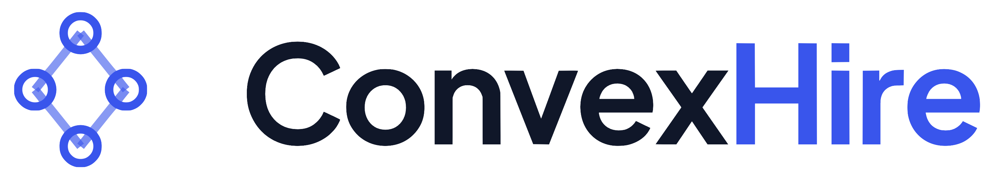

<div align="center">
  <picture>
    <source media="(prefers-color-scheme: dark)" srcset="docs/ConvexHire.png" />
    <source media="(prefers-color-scheme: light)" srcset="docs/ConvexHire_transparent.png" />
    
  </picture>
  
  # ConvexHire
  
  **Multi-Agent Recruitment Automation & Job Marketplace**
  
  *An intelligent, bias-aware recruitment platform leveraging Multi-Agent Systems (MAS) and Retrieval-Augmented Generation (RAG).*

  [](https://www.python.org/downloads/)
  [](https://nodejs.org/)
  [](https://fastapi.tiangolo.com/)
  [](https://nextjs.org/)
  [](https://www.docker.com/)
  [](https://github.com/astral-sh/uv)
  [](LICENSE)
  
</div>

---

## Introduction

ConvexHire is an advanced recruitment ecosystem designed to close the "Candidate Experience Gap." Traditional Applicant Tracking Systems (ATS) rely on opaque keyword matching that often disqualifies eligible candidates without explanation.

This project implements a **Multi-Agent System (MAS)** where specialized AI agents handle distinct recruitment tasks—from semantic resume parsing to automated interview scheduling—orchestrated by **LangGraph**. The system emphasizes **Explainable AI (XAI)**, providing transparency in match scoring and keeping a human-in-the-loop for all critical hiring decisions.

## System Workflow

The platform handles complex interactions between Recruiters and Candidates. The workflow below illustrates the end-to-end journey, highlighting the **Human-in-the-Loop (HITL)** checkpoints where AI suggestions require human approval (e.g., JD Approval, Final Hiring Decision).

<div align="center">
  
</div>

---

## System Architecture

ConvexHire operates on a scalable microservices architecture. The backend leverages **LangGraph** to orchestrate the state between various AI agents (JD Generator, Resume Screener, Scheduling Agent), ensuring context is maintained throughout the recruitment lifecycle.

**Key Architectural Components:**
*   **Orchestration Layer:** LangGraph manages the flow between the Recruiter Agents and Candidate Agents.
*   **Data Persistence:** PostgreSQL (Supabase) for relational data and Qdrant for vector embeddings.
*   **Integration Layer:** Connects to external services (Calendar APIs, Email Services, E-Signature).

<div align="center">
  
</div>

---

## Technical Deep Dive: OCR Benchmark Analysis

A critical component of ConvexHire is the **Resume Parsing Agent**. To ensure high-fidelity extraction from scanned or non-selectable PDF resumes, a comparative analysis of four major OCR engines was conducted.

The goal was to identify an engine that balances low Word Error Rate (WER) with the ability to preserve complex document layouts (e.g., multi-column CVs).

**Evaluation Context**
*   **Dataset:** 5 Double Column CVs containing complex formatting (scanned + stylized).
*   **Metric:** Word Error Rate (WER).
*   **Execution:** Comparative testing on local hardware versus cloud-hosted GPU environments.

### System Comparison

| OCR System | Avg. WER | Layout Handling | Table Extraction | Speed (per CV) | Hardware Req | Notes |
| :--- | :--- | :--- | :--- | :--- | :--- | :--- |
| **Docling (IBM)** | **2.1%** | **Very Strong** | **Excellent** | **~1.9s** | **Moderate CPU/GPU** | **Selected for production due to consistency.** |
| Chandra OCR | 2.4% | Strong | Very Good | ~2.3s | High-end GPU (12GB+) | Tested via Datalab due to high compute cost. |
| Paddle OCR | 5.8% | Decent | Fair | ~1.5s | Light CPU/GPU | Struggles with complex formatting recovery. |
| Tesseract | 19.7% | Weak | Poor | ~1.1s | Very Light | Insufficient for modern resume layouts. |

### Performance Breakdown by Document

| Engine | CV1 WER | CV2 WER | CV3 WER | CV4 WER | CV5 WER | Avg. WER | Execution Method |
| :--- | :--- | :--- | :--- | :--- | :--- | :--- | :--- |
| **Docling** | **1.6%** | **2.3%** | **2.0%** | **2.7%** | **1.8%** | **2.1%** | **Ran locally** |
| Chandra | 1.9% | 2.8% | 2.3% | 2.6% | 2.4% | 2.4% | Datalab Demo |
| Paddle | 4.9% | 6.3% | 5.4% | 6.8% | 5.5% | 5.8% | Ran locally |
| Tesseract | 18.4% | 21.1% | 19.3% | 22.7% | 16.9% | 19.7% | Ran locally |

*Based on this analysis, **Docling** was integrated into the Resume Parser Agent for its superior ability to maintain document structure, which is vital for downstream LLM reasoning.*

## Project Milestones

### Phase 1: Foundation
- [x] Authentication & Session Management (RBAC)
- [x] Database Schema & Migration Setup (Alembic)
- [x] Responsive Candidate Dashboard

### Phase 2: AI Agents & Automation
- [x] **Resume Screening Agent:** Semantic analysis with PII redaction.
- [x] **OCR Integration:** Implementation of Docling for non-digital PDFs.
- [ ] **JD Generator:** Agentic creation of job descriptions from brief prompts.
- [ ] **Job Broadcaster:** Automated multi-platform posting.
- [ ] **Scheduling Agent:** Autonomous interview negotiation.
- [ ] **Offer Generator:** Template-based offer letter automation.

### Phase 3: Search & Discovery
- [x] Job Feed with basic filtering.
- [x] Job Recommendation Engine (Recency-based).
- [ ] RAG-Based Talent Pool (Semantic search over candidate history).

## Setup Guide

### Prerequisites
*   Node.js (v18+)
*   Python (v3.10+)
*   UV Package Manager (`pip install uv`)

### Installation

1.  **Clone the Repository**
    ```bash
    git clone https://github.com/devrahulbanjara/ConvexHire.git
    cd ConvexHire
    ```

2.  **Frontend Configuration**
    Navigate to the frontend directory, configure the environment, and install dependencies.
    ```bash
    cd frontend
    cp .env.local .env
    # Update .env with your API keys
    npm install
    npm run dev
    ```

3.  **Backend Configuration**
    Open a new terminal. Navigate to the backend, configure the environment, and sync dependencies using `uv`.
    ```bash
    cd backend
    cp .env.example .env
    # Update .env with Database and LLM credentials
    uv sync
    uv run fastapi dev
    ```

The application will be accessible at `http://localhost:3000`.

## Citations & Acknowledgements

This project utilizes **Docling** for efficient document conversion. We gratefully acknowledge the work of the IBM Research team:

> Livathinos, N., Auer, C., Lysak, M., Nassar, A., Dolfi, M., Vagenas, P., ... & Staar, P. W. J. (2025). *Docling: An Efficient Open-Source Toolkit for AI-driven Document Conversion*. arXiv preprint arXiv:2501.17887. Available at: [https://arxiv.org/abs/2501.17887](https://arxiv.org/abs/2501.17887)

```bibtex
@misc{livathinos2025doclingefficientopensourcetoolkit,
      title={Docling: An Efficient Open-Source Toolkit for AI-driven Document Conversion}, 
      author={Nikolaos Livathinos and Christoph Auer and Maksym Lysak and Ahmed Nassar and Michele Dolfi and Panos Vagenas and Cesar Berrospi Ramis and Matteo Omenetti and Kasper Dinkla and Yusik Kim and Shubham Gupta and Rafael Teixeira de Lima and Valery Weber and Lucas Morin and Ingmar Meijer and Viktor Kuropiatnyk and Peter W. J. Staar},
      year={2025},
      eprint={2501.17887},
      archivePrefix={arXiv},
      primaryClass={cs.CL},
      url={https://arxiv.org/abs/2501.17887}, 
}